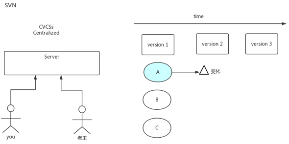
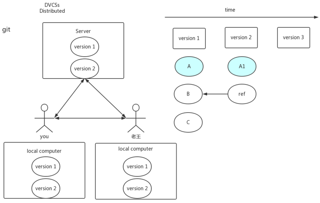
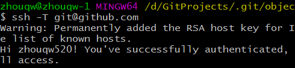
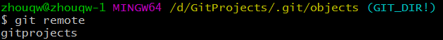
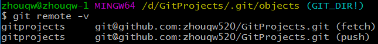
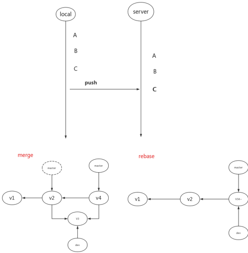
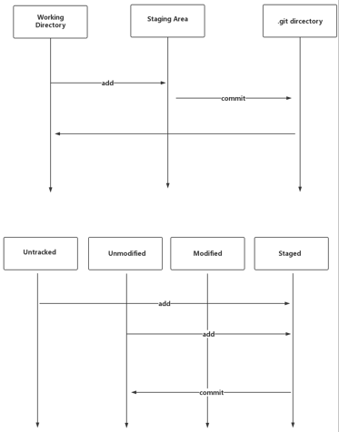
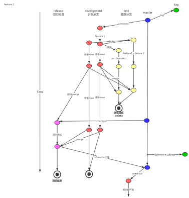

# Git学习笔记

[TOC]

## 一、git与svn的区别

​	svn只存储变化，git存储所有包括文件与更新记录

 	git去中心化

​	svn为集中式管理，git为分布式管理。

​	svn存储的是变化，git存储的是完整的文件。（没有变化指针指向到之前的文件）

​        **svn与git流程比较：**

​        

​         

## 二、常用命令

### 	1、安装配置

​	  （1）git config --global user.name <用户名>

​	  	    初始化用户名。操作系统下默认生成配置文件C:\Users\Administrator\ .gitconfig，内容如下：

​    			[user]

​             			name = <用户名>

​	  （2）git config --global user.email <邮箱地址>

​                    初始化邮箱。操作系统下默认生成配置文件C:\Users\Administrator\ .gitconfig，内容如下：

​    		    [user]

​              			email = <邮箱地址>

​          （3）ssh -T git@github.com

​		    测试SSH连通性，[git@github.com](mailto:git@github.com)为固定写法不可变更。

​		    

​          （4）ssh-keygen -t rsa -C <邮箱地址>

​		    生成SSH公私密钥。操作系统下默认生成配置文件C:\Users\zhouqw\.ssh\id_rsa、

​                    C:\Users\zhouqw\.ssh\id_rsa.pub

​		    id_rsa（私钥）、id_rsa.pub（公钥）。

###         2、常用命令

​	  （1）git status

​	  （2）git ac 'add 1.txt'

​	  （3）touch a.txt

​          （4）git log

​		    git log --graph

​                    git log --pretty=oneline

​                    git log --oneline

​	  （5）git remote

​	  （6）git clone git@xxx.com

​          （7）git remote

​		    远程项目进行关联	

​                    

​		   git remote add <远程地址别名> <远程地址>

​	  （8）git remote -v

​                   

​	  （9）git log --graph

​	  （10）ll -a/ls -al

​	  （11）cd objects

 		      ll

​          （12）git config --list

​          （13）git fetch

​	  （14）git 命令 --help

​	  （15）git fetch

​          （16）git checkout

​	  （17）git commit --amend 

​	  （18）git stash

​	  （19）git merge

​	  （20）git rebase

​                      

​	  （21）git tag

​    		      版本

​	  （22）git reset

​		      1>git reset --soft

​                      2>git reset --mixed

​                      3>git reset --head

​                           git reset --head HEAD^

​         （23）git reflog

## 三、知识点总结

1、.git为本地仓库；

2、git工作流程：

​      

​      Working Directory-->Staging Area-->.git Directory

​      工作台-->暂存区-->本地仓库

​      Untracked-->Unmodified-->Modified-->Staged 

​      未进入版本控制-->未更新-->已更新-->阶段性

3、帮助文档

​      git 命令 --help

4、git flow

​      master-->checkout-->

​      开发分支（development）、提测分支（test）、回归分支（release）

5、HEAD、master与branch

​      HEAD：当前commit的引用；

​      branch：对commit的引用；

​      master：默认branch。

## 四、场景处理

1、版本已经更新到远程，需要回滚到之前一个版本。

2、一个代码完成中间需要进行其他工作代码修改。

##  五、GitFlow

流程图：

