# IntelliJ IDEA学习笔记

[TOC]

## 一、下载和安装

​	官网下载：http://www.jetbrains.com/idea/

​        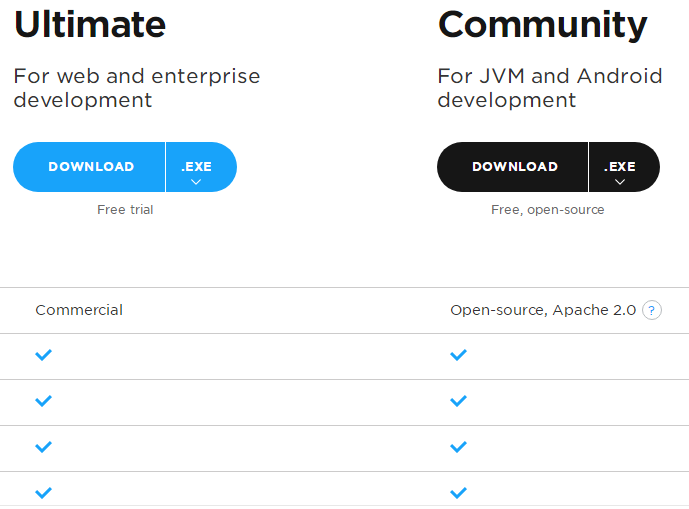

​        分旗舰版、社区版，旗舰版包含全部功能，建议下载旗舰版。

## 二、创建一个Maven工程

### 1、下载安装Maven

​          地址：https://maven.apache.org/download.cgi

​          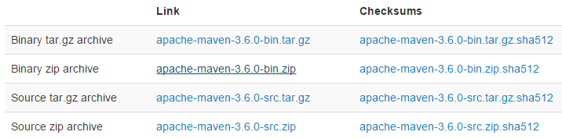

​           注意：选择[apache-maven-3.6.0-bin.zip]这个版本解压缩即可。

### 	2、添加SDK

​	  （1）New->Project

​          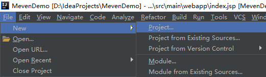

​          （2）选择JDK路径

​	   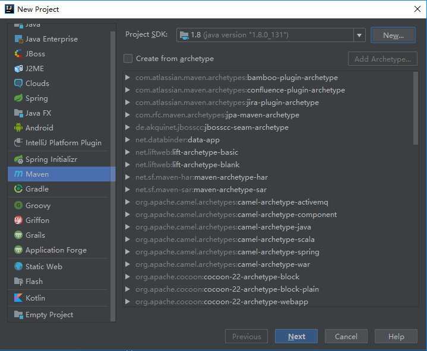

###         3、选择archetype

​	 一般使用quickstart、webapp。

​         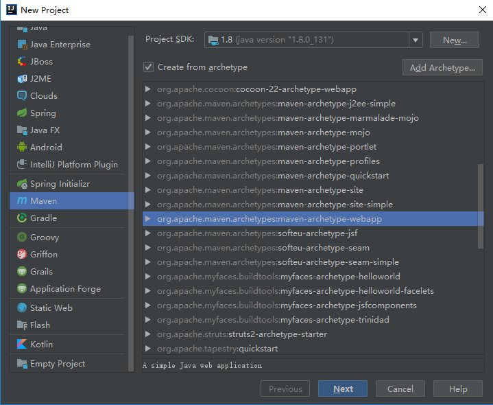

​         备注：千万选择第二个webapp，不要选择第一个。

### 4、New Project

​          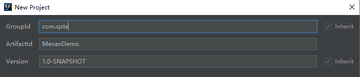

### 5、选择Maven home

​         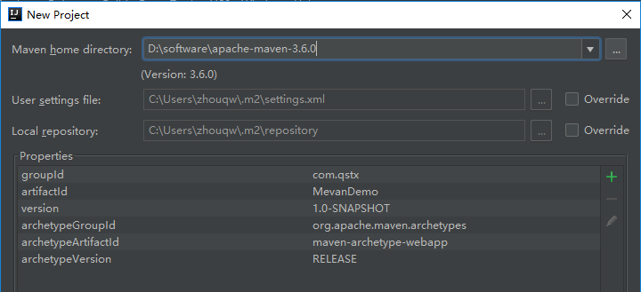

## 三、常见设置

### 1、Maven home设置

​         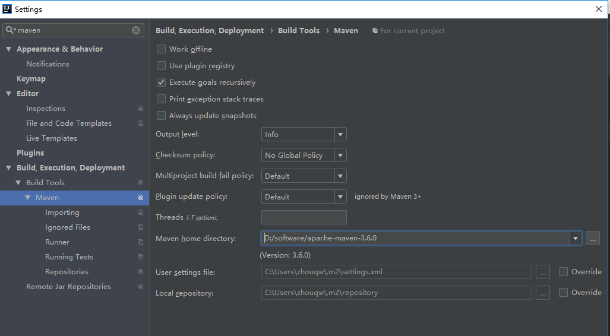

### 2、设置SDK编译版本

​     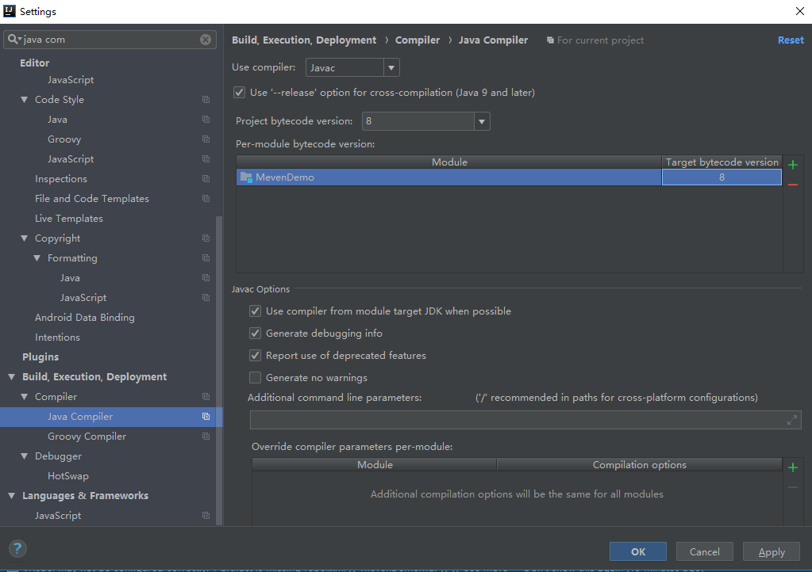

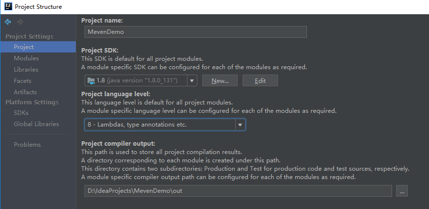

## 四、Tomcat部署Web工程

### 1、添加tomcat安装目录

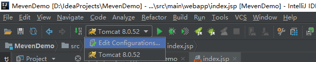

### 2、Tomcat Configurations   

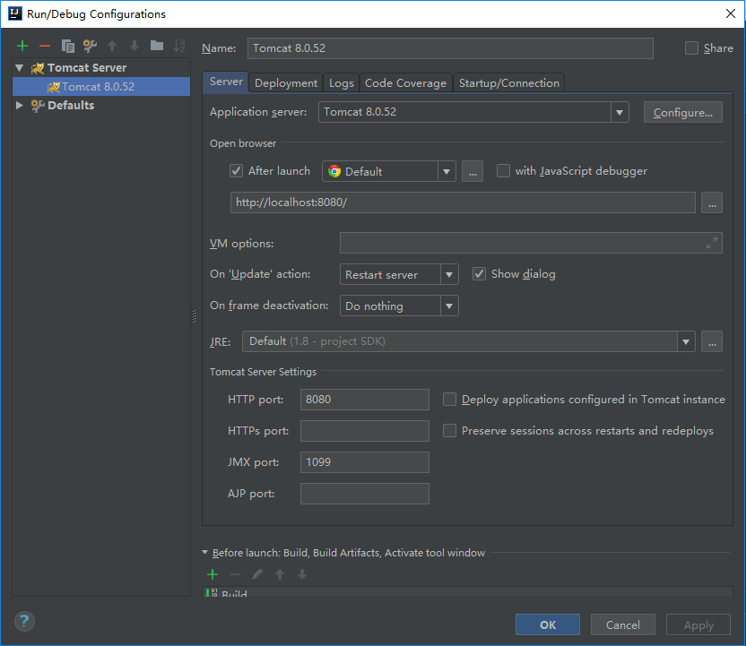

### 3、Tomcat Server

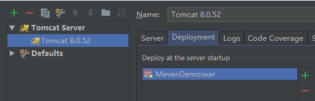

### 4、启动  

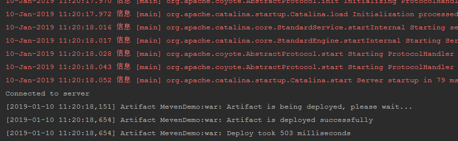

### 5、前台展示结果

## 五、快捷键

1、双击Shift-->搜索

