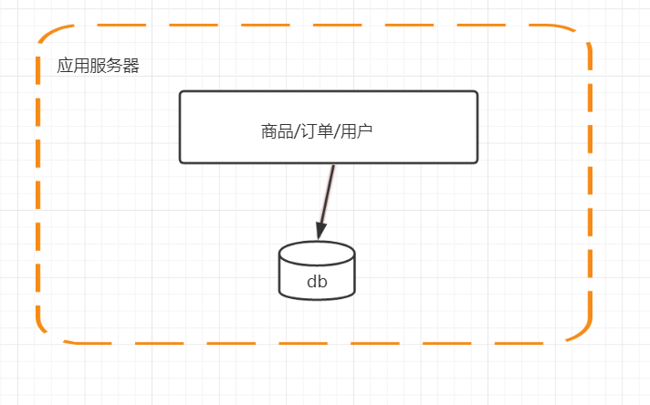
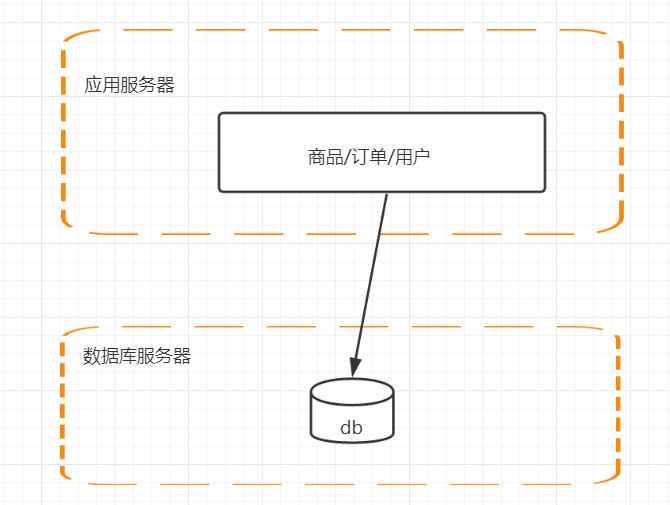
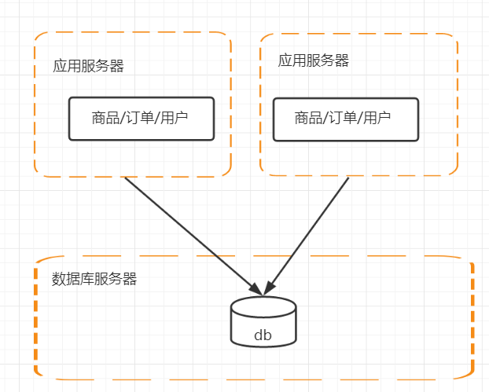
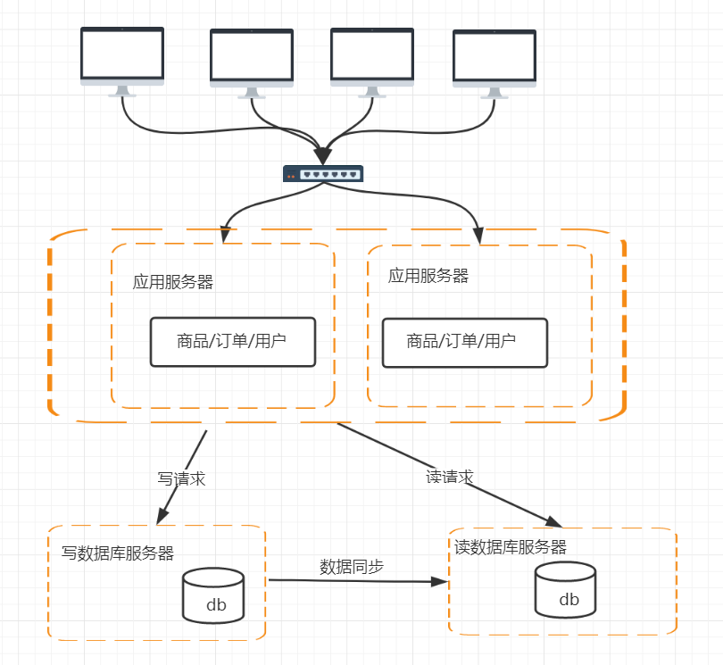
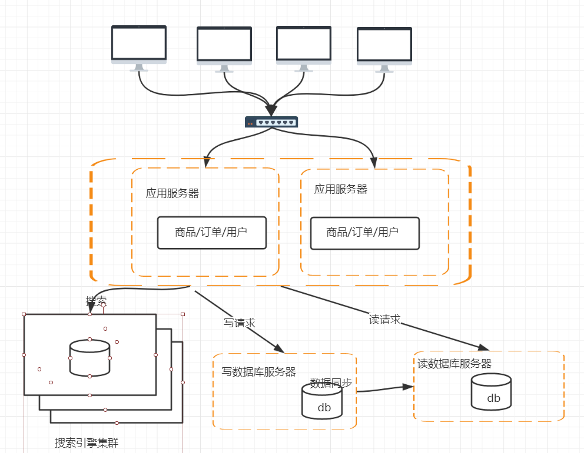
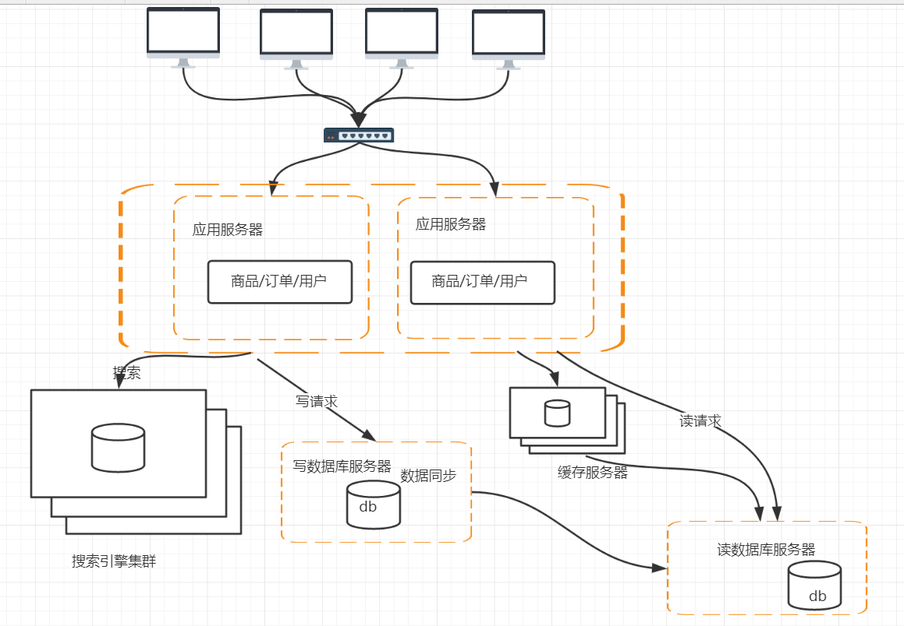
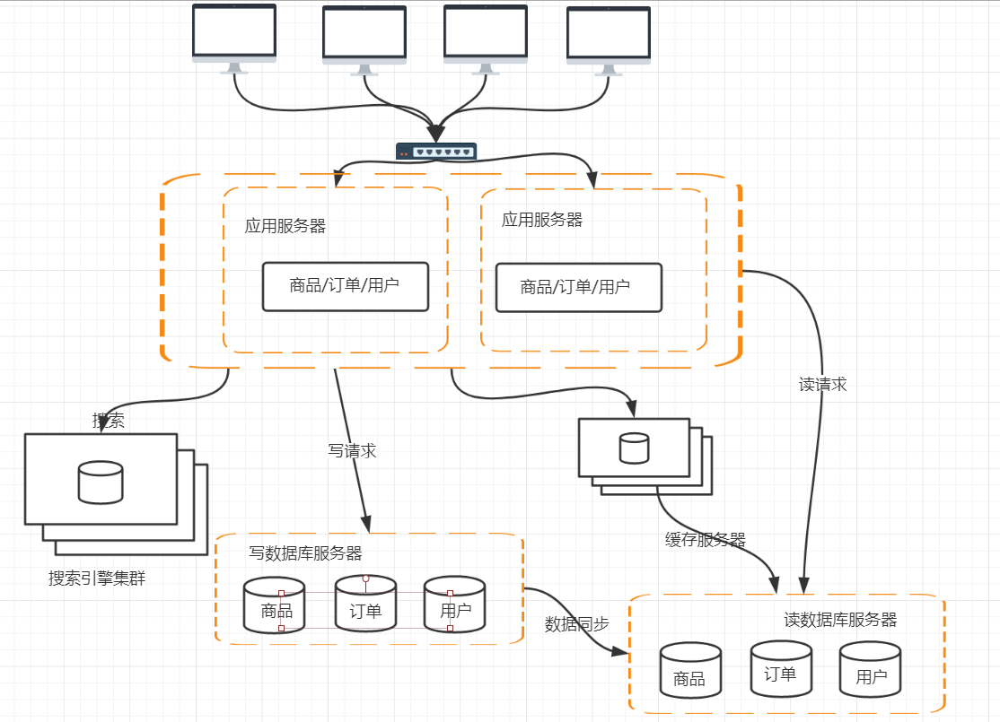
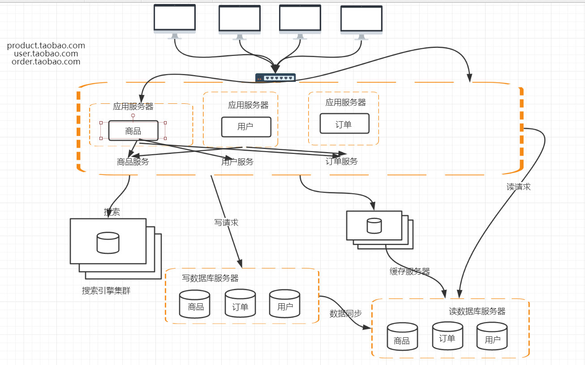

# 分布式专题-分布式架构概述

（网络协议TCP/IP和UDP/IP）

[TOC]

# 一、TCP/IP

​	**作为一名架构师，我们要专业，要能看懂代码，即使光着臂膀去机房，也能独挡一面！即使同事搞不定问题，或者撂挑子，你也能给老大一个坚定的眼神：不怕，有我在！还能在会议室上滔滔不绝，如若无人，让不懂技术的妹子看你时眼神迷离，就好想落霞与孤鹜齐飞！**

## 1、什么是分布式？

​	高并发、海量数据

​	（1）任务分解

​	（2）节点通信

## 2、分布式和集群的关系

​	电商平台：用户、商品、订单、交易

​	分布式：一个业务拆分成多个子系统，部署在不同的服务器上

​	集群：同一个业务，部署在多个服务器上

## 3、TPS和QPS

​       TPS：Transactions Per Second（每秒传输的事物处理个数），即服务器每秒处理的事务数。TPS包括一条消息入和一条消息出，加上一次用户数据库访问。（业务TPS = CAPS × 每个呼叫平均TPS）

​	TPS是软件测试结果的测量单位。一个事务是指一个客户机向服务器发送请求然后服务器做出反应的过程。客户机在发送请求时开始计时，收到服务器响应后结束计时，以此来计算使用的时间和完成的事务个数。

​	一般的，评价系统性能均以每秒钟完成的技术交易的数量来衡量。系统整体处理能力取决于处理能力最低模块的TPS值。

​	QPS：每秒查询率QPS是对一个特定的查询服务器在规定时间内所处理流量多少的衡量标准，在因特网上，作为域名系统服务器的机器的性能经常用每秒查询率来衡量。对应fetches/sec，即每秒的响应请求数，也即是最大吞吐能力。

# 二、计算机的发展历史

## 1、1946 情人节

## 2、1964	IBM	SYSTEM/360

​	超强的计算能力、高可靠性

## 3、X86 CPU

## 4、RISC CPU 小型机

​	软件架构往集中式发展，成为当时软件架构的主流。

# 三、分布式架构的发展

## 1、时机成熟了

​	PC机的性能不断提升

## 2、企业必须要做

​	去IOE

​	IBM小型机、Oracle Rac、EMC存储设备

​	PC		       MySQL	      mariadb

​	2013年5月17号，最后一台IMB小型机下线

​	单机计算机的架构->分布式计算机架构

# 四、架构的发展演变过程

​	lamp	BAT

## 1、什么是大型网站

​	（1）访问量（tps、qps）

​	（2）数据量（存储数据量）

## 2、电商平台的发展

​	用户、商品、订单

​	容器：tomcat；	jsp/servlet

​	数据库存储：mysql

​	网络层面的知识：tcp/udp

### （1）第一版应用

### （2）第二版 单机负载越来越高，数据库服务器和应用服务器分离

### （3）第三版 应用服务器做集群

​	1>session

​		cookie存储的是JSESSIONID

​		ConcurrentMap	key JESSIONID	values	session

​	解决session跨域共享问题

​	1>session sticky

​	2>session replication

​	3>session 集中存储

​		存储在db、存储在缓存服务器（redis）

​	4>cookie（主流）

​		access_token（userid/token/timestamp）

​		soa架构和为服务架构

### （4）第四版 数据库的高性能操作

​	1>数据库的读写分离

​	2>数据库的数据同步

​	3>数据库路由mycat

### （5）第五版 电商平台最多的操作：搜索商品

​	问题：

​	1>搜索引擎的索引数据怎么去做同步，实时增量同步？还是定时全量同步？

### （6）第六版 解决访问量持续增高，引入缓存机制

​	用户量是没有上限的

​	缓存、限流、降级

### （7）第七版 数据库的水平/垂直拆分

### （8）第八版

