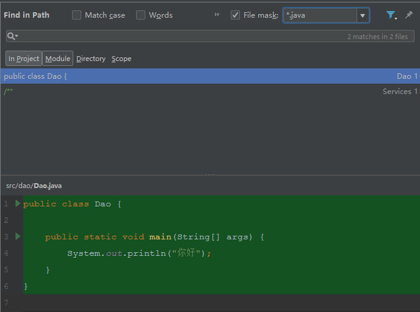

# 工程化专题-IntelliJ IDEA

[TOC]

## 一、下载和安装

​	官网下载：http://www.jetbrains.com/idea/

​        

​        分旗舰版、社区版，旗舰版包含全部功能，建议下载旗舰版。

## 二、创建一个Maven工程

### 1、下载安装Maven

​          地址：https://maven.apache.org/download.cgi

​          

​           注意：选择[apache-maven-3.6.0-bin.zip]这个版本解压缩即可。

### 	2、添加SDK

​	  （1）New->Project

​          

​          （2）选择JDK路径

​	   

###         3、选择archetype

​	 一般使用quickstart、webapp。

​         

​         备注：千万选择第二个webapp，不要选择第一个。

### 4、New Project

​          

### 5、选择Maven home

​         

## 三、常见设置

### 1、Maven home设置

​         

### 2、设置SDK编译版本

​     

## 四、Tomcat部署Web工程

### 1、添加tomcat安装目录

### 2、Tomcat Configurations   

### 3、Tomcat Server

### 4、启动  

### 5、前台展示结果

## 五、Maven工程的文件标识

​	Sources Root：代码路径

​	Test Sources Root：测试代码路径

​	Resources Root：资源路径

## 六、乱码问题	

### 1、Idea64.exe.vmoptions

​	在安装文件bin下idea64.exe.vmoptions文件中添加如下文本内容：

​	-Dfile.encoding=UTF-8

​	

​         配置后：

​	

### 2、Run/Debug Configurations

​	VM options:-Dfile.encoding=UTF-8

​	

### 3、File encoding

​	

​	

### 4、File->Settings->Editor->File encodings

​	

### 5、Default Setting->Editor-->File Encoding

## 七、快捷键

### 1、设置方式

​          file->setting

​	  

​	  setting->keymap

### 2、Ctrl+Z		撤销

### 3、Ctrl+Shift+Z	重做

​	 撤销原操作。

### 4、Ctrl+C、Ctral+V、Ctrl+X	复制、粘贴、剪切	

### 5、Ctrl+F		当前文件查找

​	

### 6、Ctrl+Shift+F	全文检索

​	

### 7、Ctrl+R		当前文件查找替换

​	

### 8、Ctrl+Shift+R	全文检索替换

​	

### 9、Double Shift	全局查找文件

​	

### 10、Alt+F7		当前方法被调用的地方

​	

### 11、Ctrl+Alt+B	快速定位当前方法的实现

​	选择方法查看其实现部分。

### 12、Alt+Insert	快速生成构造方法、Get/Set方法、overriding、实现接口

​	

### 13、Ctrl+/		单行注释

​	

### 14、Ctrl+Shift+/	多行注释

​	

### 15、Ctrl+Alt+L	格式化代码

​	代码格式化。

### 16、Ctrl+Alt+O	优化import

### 17、Alt+Enter	自动导入包

### 18、Shift+F6	重命名文件

### 19、Ctrl+D		复制当前行并粘贴到当前行下

### 20、Ctrl+Y		删除当前行

## 八、恢复最近修改内容

### 1、文件右键

### 2、项目右键

